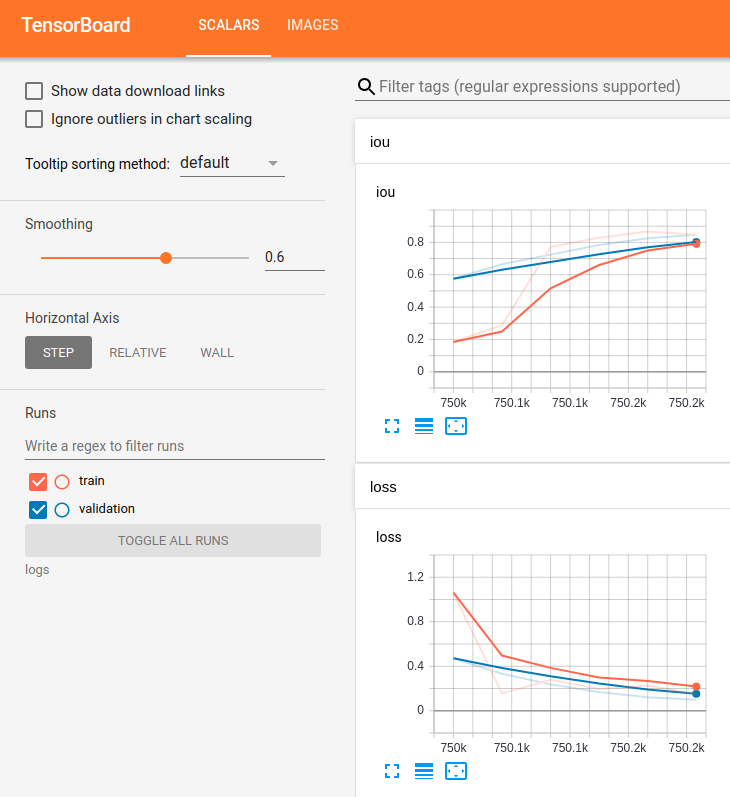
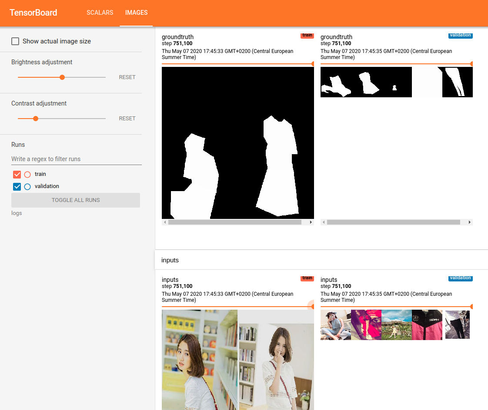

# Unet segmentation

This repository contains the resources needed for semantic segmentation
using Unet for Pytorch.

## Setting environment up

Make sure conda >=4.8.3 is installed in your system. Then, type:

```shell script
conda env create -f unet_segmentation/environment.yml
conda env activate unet
```

# Training

First of all, we need to ensure we have data to train on. We can generate
fashion data through the Deep Fashion 2 dataset by following the instructions
in the [dataset directory](dataset).

Once your dataset is generated and your environment is active, you can type:

```shell script
python unet_segmentation/trainer.py
``` 

This script assumes your dataset is located in `segmentation_dataset` and will
start logging Tensorboard data into `logs`.

You can visualize this data by typing:

```shell script
tensorboard --logdir=logs
```

You will be able to visualize the following:

Metrics in Tensorboard     |  Predicted and groundtruth masks in Tensorboard
:-------------------------:|:-------------------------:
  |  

## Pre-trained model

A  pre-trained model (Mean IOU 0.63) is available [here](https://drive.google.com/file/d/1sC_puW3pc6P75KTi2hJxgjgUiZo3zl1Q/view?usp=sharing).

Given model weights are in `unet.pt`, you can predict mask on example `example.png` by:

```python
import torch
from unet_segmentation.prediction.display import display_prediction

model = torch.load('unet.pt')
display_prediction(model, 'example.png')
``` 

# Future work

- [ ] Add test evaluation for generated models.
- [ ] Argument parsing in trainer script (as parameters are hard-coded in the trainer script).
- [ ] Port code to Pytorch Ignite.
- [ ] Generate masks in a GAN-fashion. 
- [ ] Explore using trained model for clothing retrieval.
